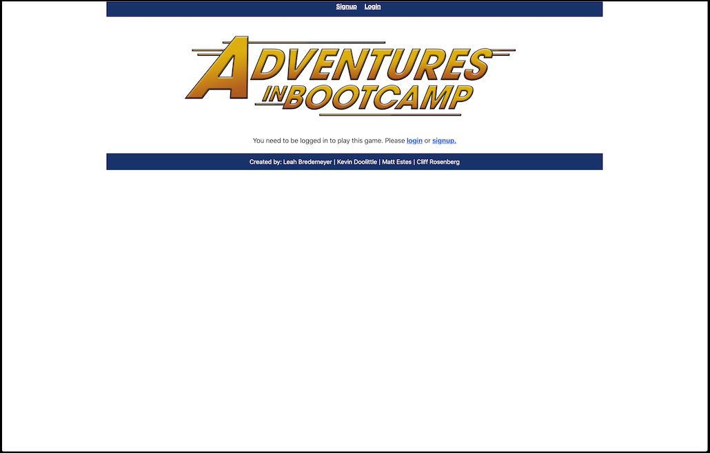

# 23-Group-Project-3

## Table of Contents-
- [RPG - Bootcamp Adventure](#bootcamp-adventure)
  - [Table of Contents-](#table-of-contents-)
  - [Licensing](#licensing)
  - [Description](#description)
  - [Installation](#installation)
  - [Screenshots](#screenshots)
  - [Usage](#usage)
  - [Credits](#credits)
  - [Contributing](#contributing)
  - [Testing](#testing)
  - [Additional Info](#additional-info)

## Licensing

Link: [MIT License](https://opensource.org/licenses/MIT)

## Description 👀

This is a simple text-based game rendered by React that allows the user to navigate through a series of questions that move them through some humorous scenarios that *may* 😁 occur in a coding bootcamp student's journey. The application provides page user authentication though JSON Web Tokens. User accounts are handled by the Apollo Client interface and stored in a MongoDB database.

## Installation 🖥

No installation is necessary, the application is hosted live on Heroku: [https://hidden-falls-09723.herokuapp.com/](https://hidden-falls-09723.herokuapp.com/)

## Screenshots 📸

Initial launch screen:

## Usage 👈

Navigate to the URL [https://hidden-falls-09723.herokuapp.com/](https://hidden-falls-09723.herokuapp.com/) - Then create a user login and launch the game.

## Credits 💬

The following technologies were used in this project:

[React.js](https://reactjs.org/) - A JavaScript library for building user interfaces

[Apollo Client](https://www.apollographql.com/apollo-client) - A framework for binding data to your UI with GraphQL

[MongoDB](https://www.mongodb.com/) - A "NoSQL" database that uses a JSON-like document model

[Mongoose.js](https://mongoosejs.com/) - The ORM for MongoDB in Node.js

## Contributing

  [Contributor Covenant](https://www.contributor-covenant.org/)

## Testing ✅

  No testing is provided.

## Additional Info ❓ 

This app was created by the following coders:

[Leah Bredemeyer](https://github.com/lnbredemeyer)

[Kevin Doolittle](https://github.com/Doolittle28) 

[Matt Estes](https://github.com/matthewestes33)

[Cliff Rosenberg](https://github.com/cliff-rosenberg)